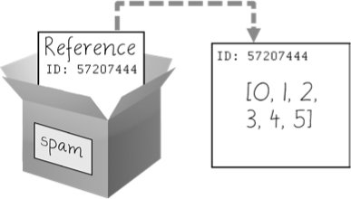
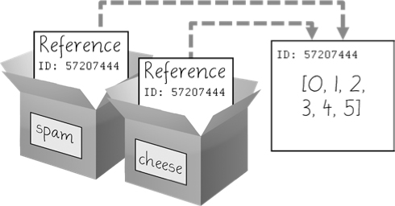

# Chapter 4 - Lists
## List Data Type

- Contains multiple value in an ordered sequence. It can store a variable or passed to a function. 
- Values inside the the list are called **items** or **elements**.

## Getting Individual Values in a List with Indexes
- **Indeces** are used to access an element in a list. It must be an Integer. 
- **Index Error** - This occurs when we use an index that exceeds the length of the list.
- **Negative Indeces** - We can start from the end/last by providing ``-1`` as its index.
- **Index Slicing** - In a slice, the **first integer** is the index where the slice **starts**. The **second integer** is the index where the slice **ends**. A slice goes up to, but will not include, the value at the second index. A slice evaluates to a new list value.

## Getting a List's Length with ``len()``
- ``len()`` - returns the number of elements that are in a list value passed to it. The function can also count the number of characters in a string value.

## Changing Values in a List with Indexes
- ``list_variable[index] = new value``

## Concatenation and Replication
- **Concatenation** - use the ``+`` operator. It is useful when creating a new list by combining two lists.
- **Replication** - use the ``*`` operator outside the list. It is useful when you have the same elements.

## Removing Values from Lists with ``del`` Statements
- The del statement will delete values at an index in a list. All of the values in the list after the deleted value
will be moved up one index.
- ``del`` ``list_name[index]``

## Using for Loops with Lists
- A common Python technique is to use ``range(len(someList))`` with a for loop to iterate over the indexes of a list.
- Using ``range(len(supplies))`` in the previously shown for loop is handy because the code in the loop can access the index (as the variable ``i``) and the value at that index (as supplies``[i]``). Best of all, ``range(len(supplies))``
will iterate through all the indexes of supplies, no matter how many items it contains.

## The ``in`` and ``not`` in operators
- You can determine **whether a value is or isn’t in a list** with the ``in`` and ``not in`` operators. 
- Like other operators, in and not in are used in expressions and connect two values: a value to look for in a list and the list where it may be found. 
- These expressions will evaluate to a **Boolean value**.

## Multiple Assignment Trick
- Technically called ***tuple unpacking*** is a shortcut that lets you assign multiple variables with the values in a list in one line of code
- The **number of variables** and the **length of the list** must be **exactly equal**, or Python will give you a ``ValueError``

## Using the ``enumerate()`` with Lists
- Instead of using the ``range(len(someList))`` technique with a for loop to obtain the integer index of the items in the list, you can call the ``enumerate()`` function instead.
- On each iteration of the loop, enumerate() will return
two values: the **index of the item** in the list, and the **item in the list** itself
- **Note**: it returns the ``index`` and ``element``

## Using the ``random.choice()`` and ``random.shuffle()`` Functions with Lists
- The ``random`` module has a couple functions that accept lists for arguments. The ``random.choice()`` function will return a randomly selected item from the list.

## Assignment Operators Shorthand
| Shorthand  | Equivalent  
|---|---|
| ``age += 1``  | ``age = age + 1``  |
| ``age -= 1``  | ``age = age - 1``  |
| ``age *= 1``  | ``age = age * 1``  |
| ``age /= 1``  | ``age = age / 1``  |
| ``age %= 1``  | ``age = age % 1``  |

## Finding a Value in a List with the ``index()`` Method
- List values have an ``index()`` method that can be passed a value, and **if that value exists in the list**, **the index of the value is returned**. 
- If the value isn’t in the list, then Python produces a ``ValueError`` error.
- When there are **duplicates** of the value in the list, **the index of its first appearance is returned**.

## Adding Values to Lists with the ``append()`` and ``insert()`` Methods
- ``append(object)`` - adds the argument to the end of the list.
- ``insert(index, object)`` - can insert a value at any index in the list.

## Removing Values from Lists with the ``remove()`` Method
- ``remove()`` - is passed the value to be removed from the list it is called on.
- Attempting to delete a value that **does not exist** in the list will result in a ``ValueError`` error.
- If the value **appears multiple times** in the list, **only the first instance of the value will be removed**
- ``del()`` - useful when you know the index of the value you want to remove from the list.
- ``remove()`` - useful when you know the value you want to remove from the list.

## Sorting the Values in a List with the ``sort()`` Method
- Lists of number values or lists of strings can be sorted with the ``sort()`` method.
- You can also pass ``True`` for the reverse keyword argument to have ``sort()`` **sort the values in reverse order**.
- **Note 1**: you **cannot sort lists** that have **both number values and string values** in them, since Python doesn’t know how to compare these values.
- **Note 2**: ``sort()`` uses **“ASCIIbetical order”** rather than actual alphabetical order for sorting strings. This
means **uppercase letters come before lowercase letters**. Therefore, the lowercase a is sorted so that it comes
**after** the uppercase Z.
- **Note 3**: If you need to sort the values in regular alphabetical order, pass ``str.lower`` for the key keyword argument in
the ``sort()`` method call

## Reversing the Values in a List with the ``reverse()`` Method
- Like the sort() list method, ``reverse()`` doesn’t return a list. This is why you write ``spam.reverse()``, instead of ``spam = spam.reverse()``

## Tuple Data Type
- It is enclosed with `()`, instead of `[]`
- Tuples **CANNOT** have their values **modified**, **appended**, or **removed**.

## Converting Types with the ``list()`` and ``tuple()`` Functions
- You **need to reassign** the variable in order to convert it into list or tuple.

## References
- Variables in Python **hold references to objects**, **NOT** the objects themselves.
- Lists are mutable, so changes made through one reference will affect all other references to the same list.

## Identity and the ``id()`` Function
- ``id()`` - returns the "identity" of an object. This identity is a unique integer that is assigned to the object when it is created. 
- It is guaranteed to be **unique and constant throughout the lifetime** of the object.
- **Shallow copy**:
    - You work with simple data structures or immutable objects.
    - You don't intend to modify the nested objects independently.
    - Performance is a major priority.
- **Deep copy**:
    - You have complex, nested data structures.
    - You must ensure changes in the copy won't affect the original.

| Key takeaways  | Shallow copy  | Deep copy  |
|---|---| --- |
| Creates new objects  | Yes  | Yes  |
| Copies nested objects  | By reference  | Recursively |
| Changes in copy affect original  | Yes  | No  |
| Use case  | Simple data, performance  | Complex data, independence  |