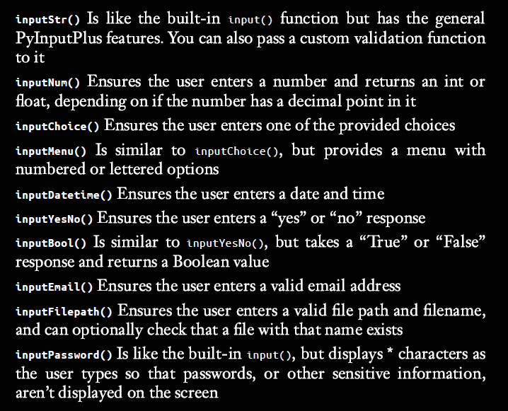

- Use ``blank=True`` if you’d like to make **input optional** so that the user
**doesn’t need to enter anything**.
- The ``inputCustom()`` function also supports the general ``PyInputPlus``
features, such as the **blank**, **limit**, **timeout**, **default**, **allowRegexes**, and
**blockRegexes** keyword arguments.
- ``inputChoice()`` function allows you to select
one of several pre-selected options
- ``inputMenu()`` also adds numbers
or letters for quick selection.