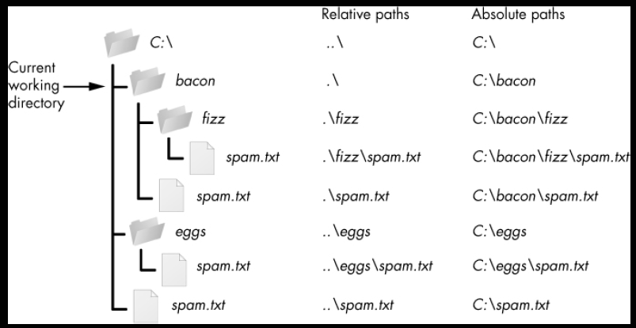

## Reading and Writing Files

## 2 properties of files:
- filename
- path (location of a file on the computer)

## Join Paths - ``/``
- This is helpful for modifying a
``Path object`` after you’ve already created it with the ``Path()`` function.
- The **first two values must be a Path object** when joining them.
- Python evaluates the / operator from **left to right** and evaluates to a Path object, so **either** the first or
second leftmost value must be a Path object for the entire expression to evaluate to a Path object.

## Absolute vs Relative Paths
- **absolute path**, which always begins with the root folder
- **relative path**, which is relative to the program’s current working directory

## Create new folders - ``os.makedirs()``

- Note that ``mkdir()`` can only make one directory at a time; it won’t make several subdirectories at once like ``os.makedirs()``.

## ``os.path`` functions
- ``os.path.abspath(path)`` - will return a string of the absolute path of the argument. This is an easy
way to convert a relative path into an absolute one.
- ``os.path.isabs(path)`` - will return True if the argument is an absolute path and False if it is a relative
path.
- ``os.path.relpath(path, start)`` will return a string of a relative path from the start path to path. If
start is not provided, the current working directory is used as the start path

## Parts of a File Path
- **anchor** - the root folder of the filesystem
- **drive** - the single letter that often denotes a physical hard drive
- **parent** - the folder that contains the file
- **name** - made up of the *stem* (base name) and the *suffix* (extension)

## ``os.path.split()``
- nice shortcut if you need both values
- does not take a file path and return a list of strings of each folder.
- use the ``split()`` string method and split on the string in ``os.sep``. (Note that ``sep`` **is in** os, **not** ``os.path``) The ``os.sep``
variable is set to the correct folder-separating slash for the computer running the program, '\\' on Windows

## File Size and Folder Contents
- ``os.path.getsize(path)`` - will return the size in **bytes** of the file in the path argument
- ``os.listdir(path)`` - will return a list of filename strings for each file in the path argument. (Note that
this function is in the os module, not os.path.)

## Modify Files - Glob Patterns
- Glob patterns are like a
simplified form of regular expressions often used in command line commands.
- ``glob()`` method - returns a
generator object (which are beyond the scope of this book) that you’ll need to pass to ``list()``
- The asterisk ``(*)`` stands for “**multiple of any characters**,” so`` p.glob('*')`` returns a generator of all files in the
path stored in p.
- ``*.?x?`` - return files with any name and any three-character extension where the middle character is an **'x'**

## Path Validity
- ``p.exists()`` - returns True if the path exists or returns False if it doesn't exist
- ``p.is_file()`` -returns True if the path exists and is a file, or returns False otherwise.
- ``p.is_dir()`` - returns True if the path exists and is a directory, or returns False otherwise.

## File Reading/Writing Process