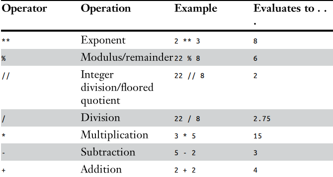
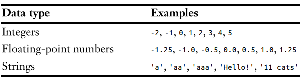
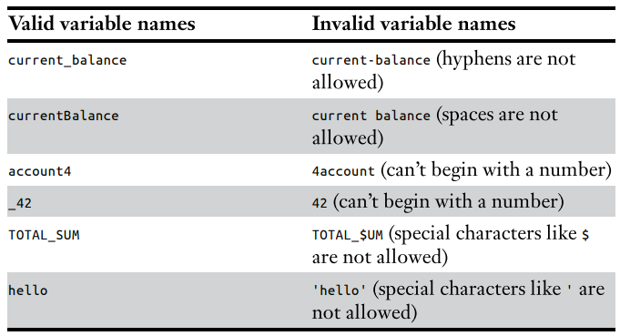

# Chapter 1 - Python Basics

**Expression** - Consist of values and operators

*Example of an Expression*: 2 + 8

**Order of Precedence**

**Data Type** - is a category for values, and every values belongs to EXACTLY ONE data type

**Common Data Types in Python**

**String Concatenation** - happens when we combine 2 str with the (+) operator

**Variable** - like a box in the computer's memory where you can store a single value

**Assignment Statements**:

- Variable name
- Equal sign (*Assignment Operator*)
- Value to be stored

**Naming Variables**

``len()`` - returns the length or number of characters in the string