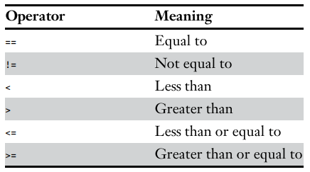
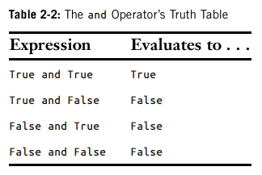
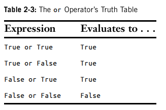
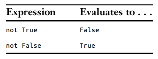

# Chapter 2 - Flow Control

## Comparison/*Relational* Operators

compare two values and evaluate down to a single Boolean value

## Difference Between the ``==`` and ``=``

- `==` (equal to) - checks whether 2 values are the same as each other

- `=` (assignment) - assigns the values on the right into the variable on the left

## Boolean Operators (AND, OR, NOT)

