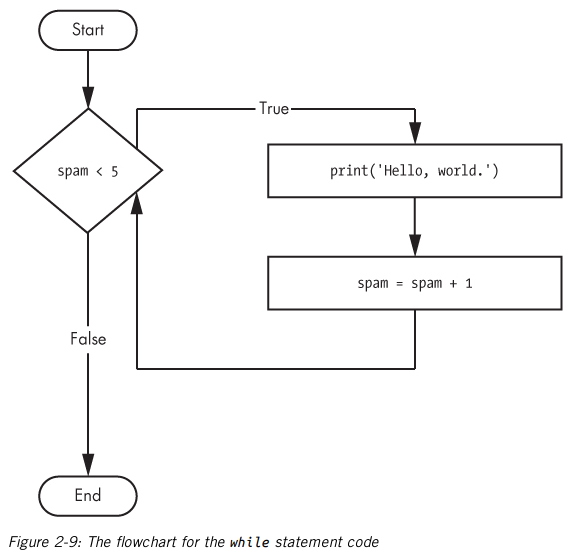

# Chapter 2 - Flow Control

## Comparison/*Relational* Operators

Compare two values and evaluate down to a single Boolean value

## Difference Between the ``==`` and ``=``

- `==` (equal to) - checks whether 2 values are the same as each other

- `=` (assignment) - assigns the values on the right into the variable on the left

## Boolean Operators (AND, OR, NOT)

## If Statement

- An if statement’s clause (that is, the block following the if statement) will execute if the statement’s condition is True. The clause is skipped if the
condition is False.
- “If this condition is true, execute the code in the
clause.”

## Else Statement

- The else clause is executed only when the if statement’s condition is False.
- “If this condition is true, execute this code. Or else, execute that code.”

## Elif Statement

- The elif statement is an “else if” statement that always follows an if or another
elif statement. It provides another condition that is checked only if all of the previous conditions were False.

## While Loop

- You can make a block of code execute over and over again using a while statement. The code in a while clause will be executed as long as the while statement’s condition is True.

## Break Statement

- If the execution reaches a break statement, it immediately exits the while loop’s clause.

## Continue Statement

- When the program execution reaches a
continue statement, the program execution immediately jumps back to the start of the loop and reevaluates the loop’s condition.
- This is also what happens when the execution reaches the end of the loop.

## For Loop and `range()`

- The range() function can also be called with three arguments.
  
 1. Start Value
 2. Stop Value
 3. Step Value

- The step is the amount that the variable is increased by after each iteration.
